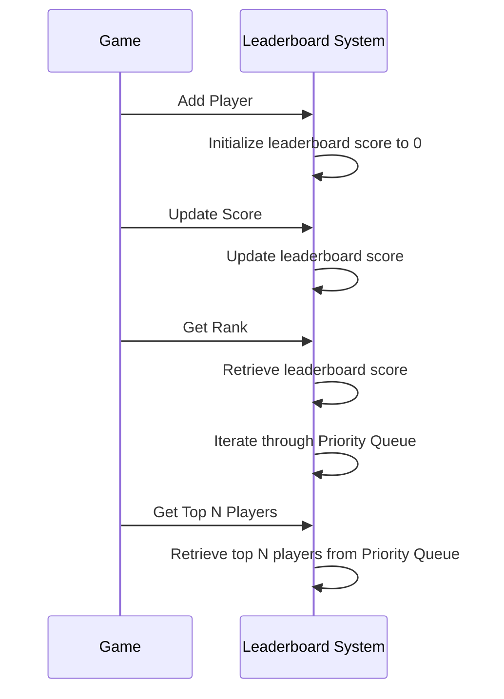

# Design a Leaderboard Score

**Problem Statement**: Design a system to calculate the leaderboard score for game of chess. The leaderboard score is calculated based on the number of games won, lost, and drawn by a player.

- A player earns positive or negative points based on the outcome of the game.
- The leaderboard score is calculated as the sum of points earned by the player.
- The leaderboard score is updated after each game.

## Requirements

1. The system should be able to calculate the leaderboard score for a player.
2. The system should be able to update the leaderboard score after each game.
3. The system should be able to return the rank of a player.
4. The system should be able to return the top N players on the leaderboard.

## Design

Choosing the right data structure is crucial for designing the leaderboard system efficiently. We can use a combination of a Hash Table and a Priority Queue to achieve the desired functionality.

### Data Structure

1. **Hash Table**: We can use a Hash Table to store the player ID and their corresponding leaderboard score. The Hash Table allows us to quickly access the leaderboard score for a given player.

2. **Priority Queue**: We can use a Priority Queue to store the players based on their leaderboard score. The Priority Queue allows us to efficiently retrieve the top N players on the leaderboard.

## Operations

### Add Player

When a new player joins the game, we need to add them to the leaderboard system. We can initialize their leaderboard score to 0 and add them to the Hash Table.

Time Complexity: O(1)

### Update Score

After each game, we need to update the leaderboard score for the players based on the outcome of the game. We can update the Hash Table with the new score for the player.

Time Complexity: O(1)

### Get Rank

To get the rank of a player, we can retrieve their leaderboard score from the Hash Table and then iterate through the Priority Queue to find their rank.

Time Complexity: O(N)

### Get Top N Players

To get the top N players on the leaderboard, we can retrieve the top N players from the Priority Queue.

Time Complexity: O(N)

Data Structure:

```plaintext
Hash Table: player_id -> leaderboard_score
Priority Queue: (leaderboard_score, player_id)
```

Sequence Diagram:


